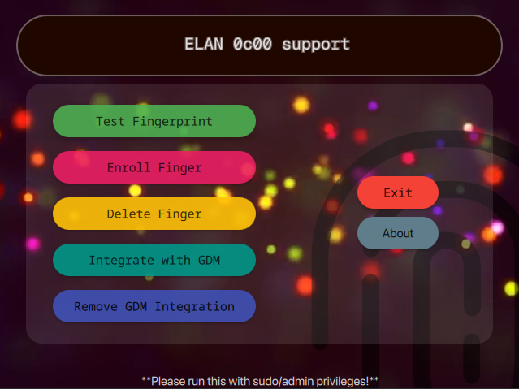

# ELAN 0c00 Support (Unofficial)

Check out the [website](https://jqx-999.github.io/host/ElanSupport/index.html)(beta)!



This program is designed to emulate/mimic the Windows driver for **ELAN:ARM-M4 04f3:0c00** on Linux. This program is made to:
* Test Fingerprint
* Enroll Fingerprint
* Delete Fingerprint
* Integrate with GDM Display Manager or sudo with custom PAM module
* Lastly, remove GDM/sudo integration


Basically, do your job for the fingerprint sensor. Currently, it just adds only the first (out of multiple) fingerprint. I would make it to add multiple fingerprints in future updates. 

## Demo Video
[Download Video](https://raw.githubusercontent.com/JQx-999/ELAN-0c00-Support-Unofficial-/refs/heads/main/assets/main.mp4) or see it on [Website](https://jqx-999.github.io/host/ElanSupport/index.html).

## Warning!!
This program is designed to directly contact/communicate with your hardware using **libusb-1.0** and **raw hexcodes** that had been captured, analyzed and optimised using Wireshark software from Windows 11. Thus making us enable to perfectly mimic the Windows driver for the hardware. So **USE AT YOUR OWN RISK. ITS POSSIBLE THAT YOU LOCK YOURSELF UP MAKING YOUR COMPUTER UNUSABLE**. Good luck for future!

## Requirements
This software has been made and tested using environments having latest **Arch Linux and Cachy OS (Preferably)** with Linux Kernel 7.0.11-zen1-1zen, GCC 16.1.1 20260430 and Qt 5.15.19 with Qt 6.11.1. 

You need to have **bash**, **xorg-xhost** for *Hyprland*, and **libglvnd**.

Note: No additional libraries of Fedora or others has been included so it won't work on the other distros leaving Arch as only option. (I have tested myself)

Use the command if you are using hyprland before running the application:
```
xhost +local:root
```
## Downloads
[Click here to download!](https://github.com/JQx-999/ELAN-0c00-Support-Unofficial-/releases/download/v0.1/Elan_0c00_support-x86_64.AppImage)

[Releases](https://github.com/JQx-999/ELAN-0c00-Support-Unofficial-/releases)

You are required to run this Appimage with admin/sudo privileges.

## A bit of nerdy stuff!

I was very frustrated that my fingerprint won't work on linux. I have checked the supported devices list on the fprint website. I can't find the listing of the specific ELAN 0c00 fingerprint scanner. There may be some workarounds but instead of trying them, I decided to make my own. Fingerprint is just faster while doing everyday tasks like running sudo commands to update my system regularly. I'm currently in my sophomore year, while I was a fresher when I started this project and recently got my results, I decided that this would be a great project to do and I would learn a lot while creating it. Long story short, I captured the raw hexcodes using Wireshark, analyzed them, optimised and created multiple C files to do several tasks and made an app using Qt, QML and QtQuick. Therefore, I accessed the usb device using libusb, sent and recieved the hexcodes using bulk transfer and integrated the C files into qml using C++ header files which made this possible! I made an Appimage so that it would be easily reproducable and transferrable without much of hassle. 

### A short note from my personal journal:
 
 I cannot belief that I made a custom driver-like software that could talk to my fingerprint scanner with raw hex-codes. I know for a fact that it stores the fingerprint data universally, like if I shift from Windows to Linux (I use Arch btw), it can work in both. It just stores the data internally. I wish it could give raw images, but I guess it is not possible. Finally, I traced all the hex codes from Wireshark and I could know couple of things. For sometime, I thought while input of wrong fingerprint, it gives 40 fd which was wrong. Most likely it is given out when in timeout. Then I traced back the hex codes and found out the code is actually 40 fe. Oh my god! I have actually secured all the sequences (probably) that I needed for my custom driver. For success, it gives out 40 00 and that's for sure! I still need to make a software that could work as a standalone software for my finger print sensor. Like I need to go into Windows to register my fingerprint which can be annoying. I feel C language is actually very good for making such low-level programs. It is very natural and I could understand a bit. I guess I have to add learning C more to my checklist. I admit that I took a lot of help from AIs just to understand and implement. Be it for emotional support or for understanding libusb. AI made searching so easy. Actually, libusb made it pretty easy for me. But I could notice patterns from hex codes that I captured. And also another thing! I noticed in the flush sequence when it erases every fingerprint captured. It actually occurs twice if there are two finger prints captured and saved. The thing I am trying to say is that, Windows doesn't allow you to manually delete each fingerprint. It removes them altogether. I could figure out a way if I could make this happen i.e. delete a particular fingerprint at a time. If I could bring this to reality, I could add a feature that the driver-makers and Windows didn't add or support. This could make my driver software superior than the native, officially supported ones. Now this is some kinda crazy stuff. I always liked programming and low-level stuffs.


Yeah! That was me thinking crazy. The dream has came true and I made this application.

I could have used GTK and libadwaita to make some slick UIs but nevermind. I chose QtQuick because it was feeling easy until I knew about threading the tasks so that my loops won't cause any freeze errors in my UI with making a C++ bridge/header file everytime I would use a C program. I took a while learning them and after that it was pretty easy on me. Completing every option in my program feels like an achievement, making the interface work and testing them repeatedly to open certain tasks feel so good.
Debuging every error made me feel proud and became my strength. Basically, header files call the C function from the C program files. Including them to main.cpp made it work. I understood a bit of how threading and QtThread works and I implemented it into main.cpp. I also added a video as background because why not. After creating the final release version of my application, I wondered why not create a standalone Appimage that would be easily transferable and portable with reproducable and compressed to a lesser size. For that, researched a lot how to create an Appimage when I stumbled into linuxdeployqt. I thought it would be pretty easy. But it gave me so many errors that I got frustrated and scrapped it off, decided to make my own. Thus I researched how to create it, what all libraries I need, what plugins would I need and how to package them properly with custom scripts so that it would work. So I figured out the file structure, mapped them correctly, used AppImage file to create one. It worked! I was very happy until I changed my desktop environment to Hyprland. Turns out that Hyprland is very strict in isolating in it's sandbox for its Xwayland server. I figured a way out by using 
```
xhost +local:root
```
and installed ```xorg-xhost``` using ```sudo pacman -S xorg-xhost``` and it finally worked. I figured out how to make a custom PAM module that would help me login and perform sudo tasks. I prefered GDM as my display manager as it was the easiest and cleanest. (You could implement this in other Display Mangers like SDDM or LightDM) I made a custom C script that returns 0 on success and 1 on failure. Copied it into ```/usr/local/bin``` to keep it safe so that I won't mistakenly delete it. Used this command ```auth    sufficient pam_exec.so quiet /usr/local/bin/elan_auth``` on the very top of ```/etc/pam.d/gdm-password``` and ```/etc/pam.d/sudo``` to make it work. Make my life a bit easier.
### A bit about hex codes
 * 0x40, 0x00 -> Correct fingerprint for Finger1
 * 0x40, 0xff, 0x03 -> Start Scanning
 * 0x40, 0xfe -> Scan Timeout, Press Longer
 * 0x40, 0xfd -> Wrong Finger
 * 0x40, 0x4_ -> Not Properly Scan, Can't Confirm if Finger Matched or Incorrect

 The above hex codes are for the testing if the fingerprint is registered or not. Simillarly, there are multiple hex codes and that ranges till 72 packet size. You just send them and wait for response. Simple.